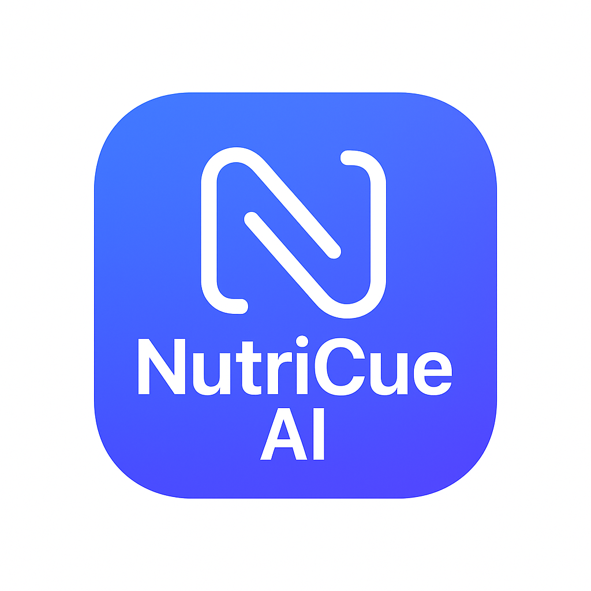

# NutriCue AI Website

This repository hosts the official website for NutriCue AI, a full-stack AI-powered reminder application. The website provides detailed feature overviews, technical architecture documentation, and complete privacy policy information. iOS and Android apps coming soon - please [email](mailto:caesiusbay@gmail.com) me if you'd like to be a tester or get the early access release.

  
The site is publicly accessible at: https://theianmay.github.io/nutricue-ai-site

      

## Repository Structure

- **index.md** — Home page featuring NutriCue AI's key capabilities and technology overview
- **screenshots.md** — Visual gallery showcasing the application interface
- **architecture.md** — In-depth technical architecture and design philosophy documentation
- **privacy.md** — Complete privacy policy covering data handling, permissions, and user rights

## Key Features Documented

The website comprehensively covers NutriCue AI's capabilities including:

- **AI-Powered Reminder Creation** with natural language processing
- **Photo-Based Reminders** using OpenAI GPT-4o Vision for image analysis
- **Smart Scheduling** with recurring patterns (daily, weekly, custom times, intervals)
- **Offline Mode** with fallback responses when AI services are unavailable
- **Notification System** with comprehensive scheduling and iOS/Android optimization
- **Subscription Management** with free tier limits and premium features
- **Full-Stack Architecture** with React Native frontend and Node.js backend

## Technical Documentation

The architecture section provides detailed insights into:
- AI integration with OpenAI GPT-4o and backend proxy architecture
- State management with Zustand stores for reminders and AI conversations
- Local storage with AsyncStorage for reminder persistence
- Backend API with Node.js, Express.js, and JWT authentication
- Notification scheduling with platform-specific optimizations
- Subscription management with RevenueCat integration
- Comprehensive testing strategy with Jest for both frontend and backend

## Purpose

This site serves as the comprehensive resource for users, developers, and stakeholders to understand NutriCue AI's functionality, technical implementation, and data practices.

## Updates

Content is regularly updated to reflect new features, architectural improvements, and policy revisions.

**Last major update:** September 19, 2025
- Updated to reflect App Store ready status
- Added onboarding flow and permission handling documentation
- Updated subscription model and feature limits
- Enhanced security documentation with backend proxy architecture
- Added App Store readiness and compliance information

© 2025 NutriCue AI. All rights reserved.
