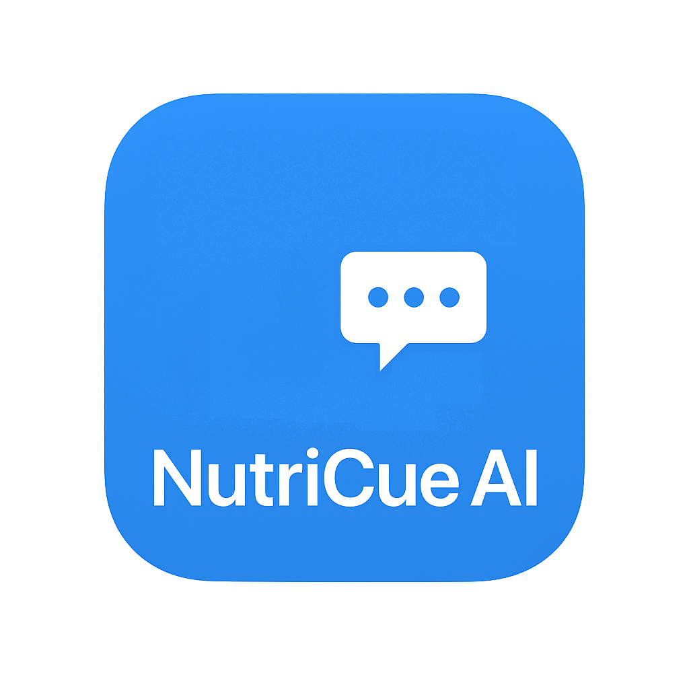

# Welcome to NutriCue AI

NutriCue AI is a mobile app that uses AI to help you remember to take your vitamins.

## Key Features

- **AI-Powered Reminder Creation** with natural language processing
- **Photo-Based Reminders** using camera integration for supplement identification
- **Smart Scheduling** with recurring patterns (daily, weekly, custom times, intervals)
- **Offline Mode** with local pattern matching for basic reminder functionality
- **Notification System** with comprehensive scheduling and iOS/Android optimization
- **Subscription Management** with free tier limits and premium features
- **Cross-Platform** React Native and Expo implementation

## Built With Modern Technology

NutriCue AI leverages React Native 0.79.5, Expo 53.0.22, and SQLite for a robust, scalable architecture that prioritizes user experience and data integrity.

## Explore the Documentation

- **[Screenshots](screenshots.md)** - Visual tour of the application interface
- **[Architecture](architecture.md)** - Detailed technical overview and design decisions
- **[Privacy Policy](privacy.md)** - Complete data handling and privacy practices

---

[Home](index.md) | [Screenshots](screenshots.md) | [Architecture](architecture.md) | [Privacy](privacy.md)

## Contact Us

For questions about NutriCue AI, technical support, or partnership inquiries:
**caesiusbay@gmail.com**

© 2025 NutriCue AI. All rights reserved.
